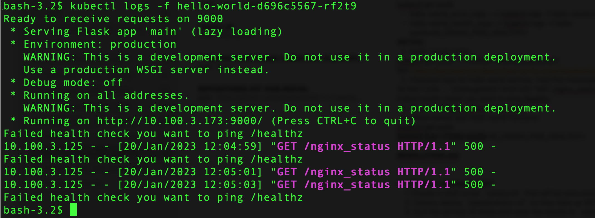
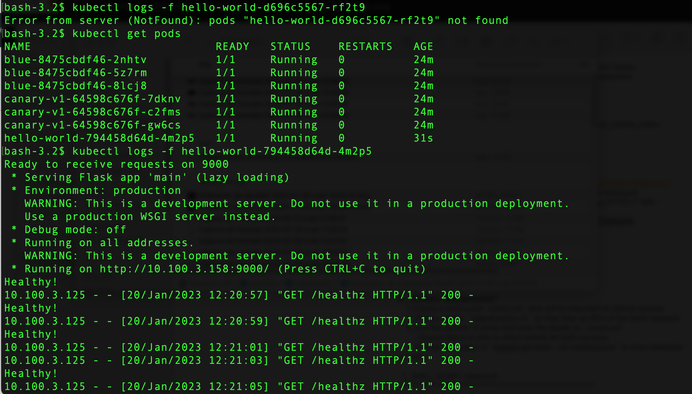

# Deployment Troubleshooting

1. I have observed that hellow-world crashing with the error CrashLoopbackOff

bash-3.2$ kubectl get pods
NAME                          READY   STATUS            RESTARTS   AGE
hello-world-d696c5567-rf2t9   0/1     CrashLoopBackOff  6          6m35s

2. I checked the logs from hello-world-d696c5567-rf2t9 pod and I have the next message

3. In the file hello.yml in the line 28 I replaced /nginx_status to /healthz

4. I launched another time the file hello.yml with the command:
   kubectl apply -f hello.yml

5. I checked that the from hello-world pod working. Also I checked the logs of pod working

