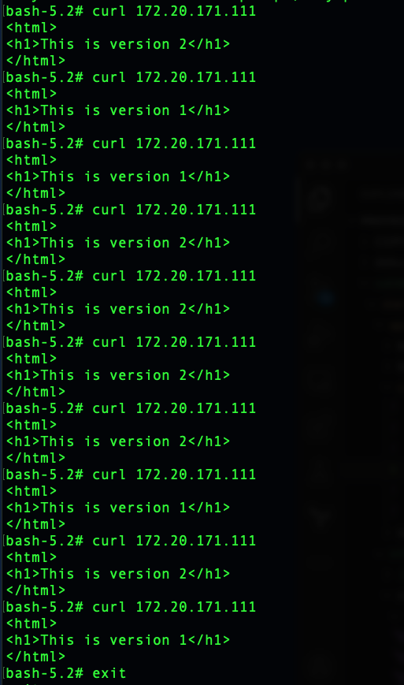

# Canary deployments

I have detected that the canary application was deployed without any service. The service is in the file: canary-svc.yml

I follow the steps:
1. I have deleted the line 9 in the canary-svc.yml file, because the service was targeted only to the **version "1.0"**

2. I have created a canary.sh script to use a canary deployment from version 1 to version 2 of two pods

3. I have launched the canary service and the canary.sh script

4. I have checked the canary deployment to version 2 with the result of two pods with version 2 and one pod with the version 1

