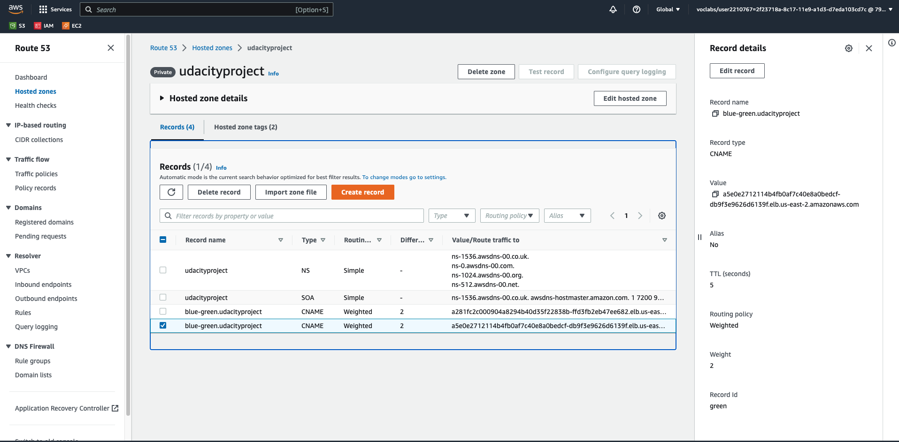

# Blue-green deployments

1. I have checked in the pods that there are only pods from blue deployments

2. I have created the green service to deploy in terraform, the name of this profile is green.yml. Also I have added in the profile dns.tf another DNS CNAME record resource for the green deployment. I have defined the same weight like blue in this new record because I need 50% blue and 50% green deployment

3. I have launched blue-green.sh to deploy green deployment

4. I have deployed another time the terraform infraestructure with the command: terraform apply

5. I have checked that we have deployed blue and green environment

6. I have checked in Route 53 that we have the two CNAME records blue and green:

* blue:

* green:

7. I have checked that the 2 Load Balancer have been created for blue and green deployment.

8. In the curl-instance I have curl the blue-green.udacityproject with the result 50% blue and 50% green.

9. I have removed in Route 53 the CNAME blue record

10. In curl-instance I have curl the blue-green.udacityproject with the result only green.

