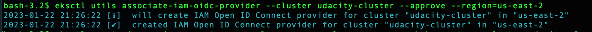

# Node elasticity

1. When I have deployed the bloaty-mcbloatface deployment, there were pods in Pending state

2. I have described one pod in Pending state and I saw that it is a space problem and I need to deploy more VM. 

We have decided to scale out that is the option cheaper than increase the size of nodes. 

3. I created an autoscaling group to trigger increases to VM's in the autoscaling group 
I create an autoscaling group with *cluster_autoscale.yml* file, that I have added this file in the bloatware file

4. I have created a node autoscaling configuration:
* Setup OIDC provider

* Create a cluster sevice account with IAM permissions

* I checked the CloudFormation cluster-autoscaler stack is in created state
 

5. In console, have checked:
* The number of EC2 instances is two

* The size of autoscaling group before to do the changes

6. I have fixed the fail to increase the size of the autoscaling group.
I have changed:
* nodes_max_size     = 3
* nodes_min_size     = 2

7. I have updated the infrastructure with *terraform apply*

8. I deployed the cluster-autoscale

9. I see that all 17 bloaty-mcbloatface pods are in Running state

10. I see that increase the number of nodes to 3

